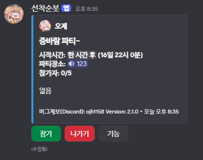

## DiscordBot

디스코드 서버에서 파티 모집, 관리 등을 자동화하는 **Discord Bot** 프로젝트입니다.

[봇 추가 링크] https://discord.com/oauth2/authorize?client_id=1443182707503792279



---

## 주요 기능

- **파티 시스템**
  - 파티 생성 / 수정 / 삭제
  - 파티 인원 관리 (참가, 탈퇴, 대기열)
  - 파티 시작 / 마감 / 만료 처리
- **길드(서버) 연동**
  - 서버별 설정 값 저장
  - 채널 / 메시지 키 기반 상태 추적
- **백그라운드 작업**
  - 만료된 파티를 주기적으로 정리하는 작업 (`CycleJob` 등)
- **버튼 / 인터랙션 처리**
  - 디스코드 버튼/인터랙션 기반 UI (`ButtonServices` 등)

필요에 따라 위 목록에 실제 구현된 기능을 더 자세히 정리하면 됩니다.

---

## 기술 스택

- **언어**: C# (.NET)
- **DB**: MySQL (`MySqlConnector`, `Dapper`)
- **로깅**: Serilog

---

## 로컬 실행 방법

### 1. 필수 요구 사항

- **.NET SDK**: 6 이상 (실제 사용 버전에 맞게 수정)
- **MySQL 서버**
- **디스코드 봇 토큰**

### 2. 환경 변수 / 설정

다음과 같은 환경 변수를 사용합니다. (실제 프로젝트 기준으로 수정)

| 변수 이름          | 설명                        | 예시 값          |
|-------------------|-----------------------------|------------------|
| `DISCORD_TOKEN`   | 디스코드 봇 토큰           | `xxxx`           |
| `DB_CONNECTION`   | MySQL 연결 문자열          | `Server=...`     |

### 3. 실행

솔루션 루트(본 README가 있는 위치)에서 다음과 같이 실행합니다.

```bash
dotnet restore
dotnet build
dotnet run
```

봇이 실행되면 디스코드 개발자 포털에서 설정한 **봇 초대 링크**로 서버에 추가해 테스트합니다.

---

## 디렉터리 구조 예시

```bash
scripts/
  _src/
    Services/
      ButtonServices.cs      # 디스코드 버튼/인터랙션 관련 로직
    CycleJob.cs              # 주기 작업 (예: 만료 파티 처리)
  db/
    Repositories/
      PartyRepository.cs     # 파티 관련 DB CRUD
      GuildRepository.cs     # 길드(서버) 관련 DB CRUD
    Services/
      PartyService.cs        # 파티 도메인 서비스
```

---

## 테스트 (선택)

테스트 프로젝트가 있다면 아래에 명령어와 함께 정리해 주세요.

```bash
dotnet test
```

---

## 아키텍처 개요

- **Repository 레이어**
  - `PartyRepository`, `GuildRepository` 등 순수 DB 접근 전담
- **Service 레이어**
  - `PartyService`, `ButtonServices` 등 비즈니스 로직 담당
- **백그라운드 작업**
  - `CycleJob` 등을 통해 주기적으로 만료된 파티를 조회/갱신

---

## 라이선스

MIT License

Copyright (c) 2025 ojh1158

Permission is hereby granted, free of charge, to any person obtaining a copy
of this software and associated documentation files (the "Software"), to deal
in the Software without restriction, including without limitation the rights
to use, copy, modify, merge, publish, distribute, sublicense, and/or sell
copies of the Software, and to permit persons to whom the Software is
furnished to do so, subject to the following conditions:

The above copyright notice and this permission notice shall be included in all
copies or substantial portions of the Software.

THE SOFTWARE IS PROVIDED "AS IS", WITHOUT WARRANTY OF ANY KIND, EXPRESS OR
IMPLIED, INCLUDING BUT NOT LIMITED TO THE WARRANTIES OF MERCHANTABILITY,
FITNESS FOR A PARTICULAR PURPOSE AND NONINFRINGEMENT. IN NO EVENT SHALL THE
AUTHORS OR COPYRIGHT HOLDERS BE LIABLE FOR ANY CLAIM, DAMAGES OR OTHER
LIABILITY, WHETHER IN AN ACTION OF CONTRACT, TORT OR OTHERWISE, ARISING FROM,
OUT OF OR IN CONNECTION WITH THE SOFTWARE OR THE USE OR OTHER DEALINGS IN THE
SOFTWARE.

