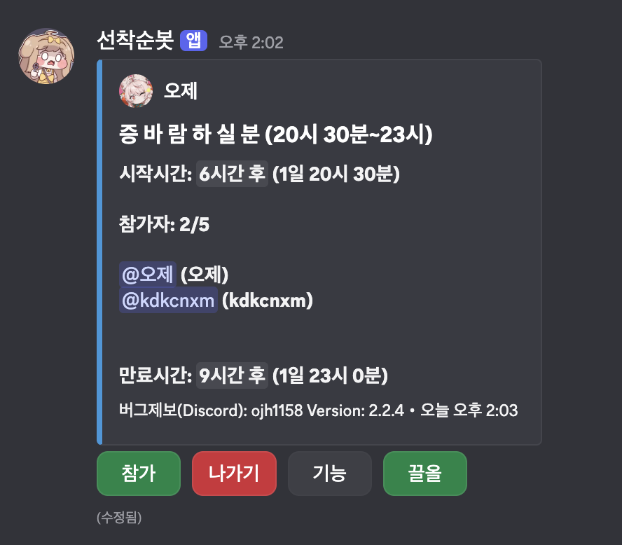
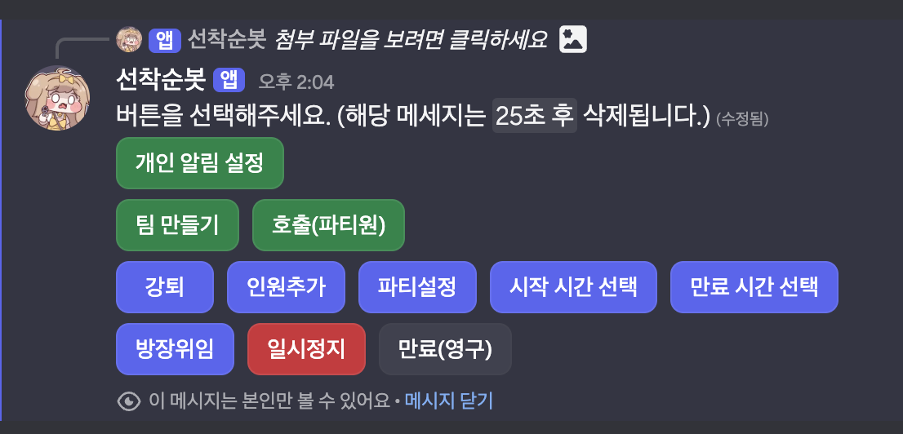
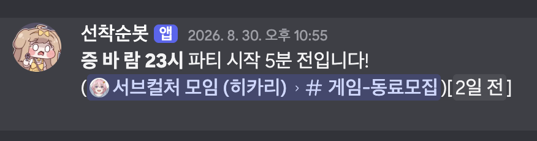
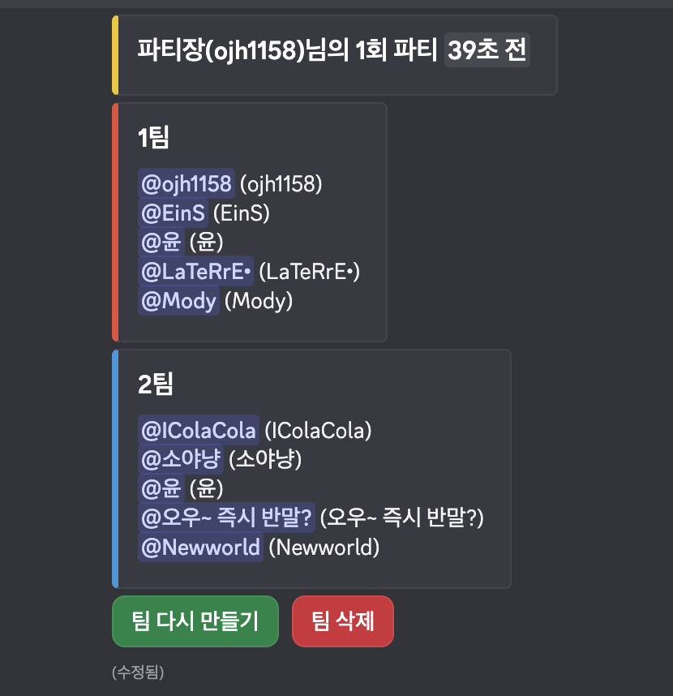
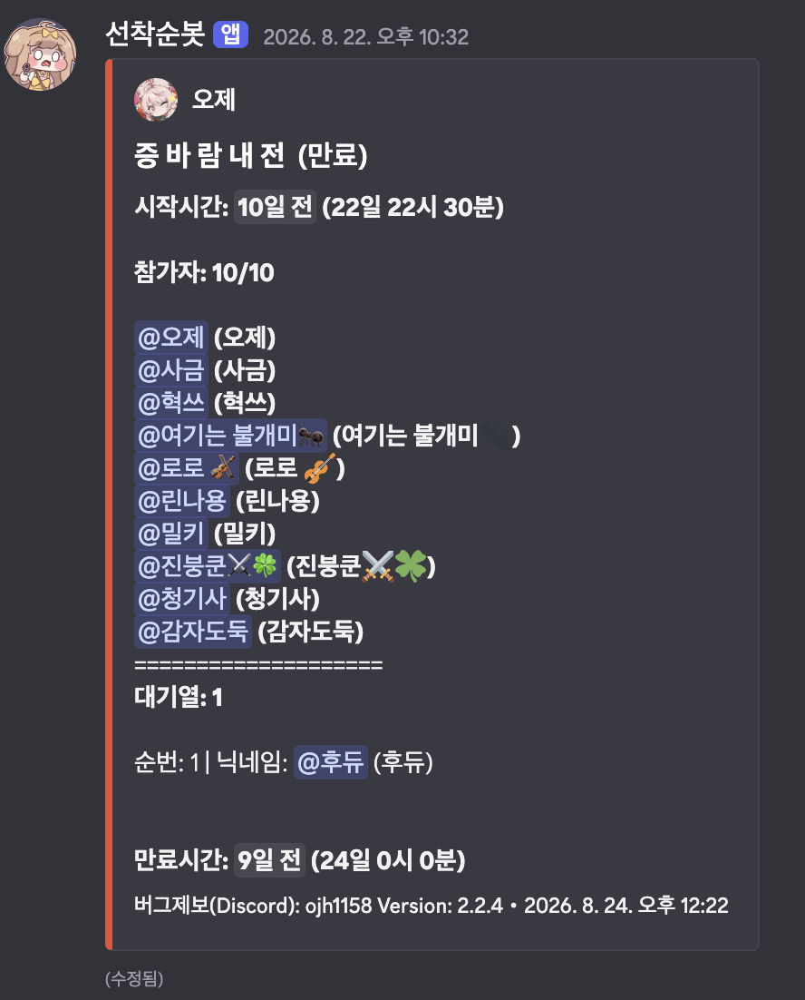
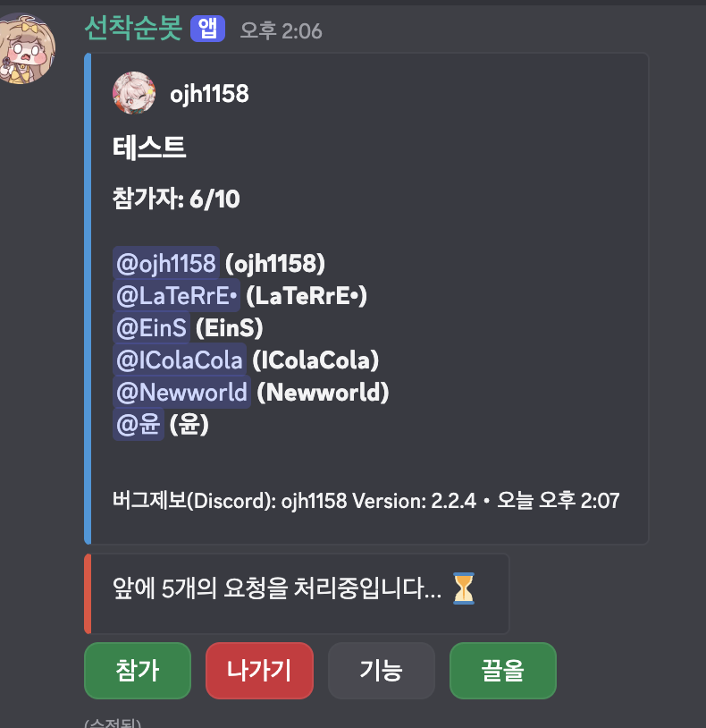

## DiscordBot `v2.2.4`

디스코드 서버에서 파티 모집, 관리 등을 자동화하는 **Discord Bot** 프로젝트입니다.

> **봇 초대 링크** https://discord.com/oauth2/authorize?client_id=1443182707503792279




---

## 스크린샷

| 파일 | 한글 원본 | 설명 |
|---|---|---|
| `preview.png` | `sample.png` | 대표 프리뷰 - 파티 Embed/Component 기본 화면 |
| `feature_menu.png` | `기능들.png` | `기능` 버튼 패널 - 권한별 버튼 노출 |
| `personal_alert_1.png` | `개인_알림_1.png` | 개인 알림 설정 1 - 6종 플래그 토글 UI |
| `personal_alert_2.png` | `개인_알림_2.png` | 개인 알림 설정 2 - 토글 결과/상세 |
| `team_build.png` | `팀_만들기.png` | 팀 만들기 - `TeamTool` 랜덤 분배 결과 Embed |
| `party_expired.png` | `만료.png` | 만료 처리 - `ExpirePartyAsync` 후 Embed/Components 제거 상태 |
| `traffic_queue.png` | `트래픽_처리.png` | 트래픽 처리 - `TaskDelayQueue` 0.5→3초 대기열 큐 상태 |

### preview - 파티 기본 화면

`/파티` 생성 직후 노출되는 Embed (`DiscordServices.UpdatedEmbed`) + `참가/나가기/기능/끌올` 버튼 (`UpdatedComponent`). 인원 초과 시 `대기하기` 로 전환.

### feature_menu - 기능 패널

`ButtonServices` 의 `기능` 버튼에서 권한(일반/파티원/대기자/방장/관리자/슈퍼방장)별로 노출되는 10+ 버튼: 개인 알림, 팀 만들기, 호출, 강퇴, 인원추가, 파티설정, 방장위임, 일시정지, 시간선택, 끌올, 만료.

### personal_alert - 개인 알림 설정


`USER_CONFIG` 기반 6종 플래그 (`ALL_ALERT_FLAG`, `MY_PARTY_FULL/JOIN/LEFT`, `JOIN_PARTY_TO_WAIT`, `PARTY_START_TIME_ALERT`) 를 `ButtonServices.UserSetting` 에서 토글. `USER_ALERT_SETTING_KEY` 인 핸들러.

### team_build - 팀 만들기

`TeamTool.Random` Fisher-Yates 셔플 결과. `MembersPerTeam = ceil(인원/팀수)`, 15색 `Color[]` 로 팀별 Embed 생성, `팀 다시 만들기/삭제` 버튼 제공.

### party_expired - 만료 처리

만료 파티 정리 결과. `CycleJob.CheckExpiredParty` 또는 `만료(영구)` 버튼 → `DiscordServices.ExpirePartyAsync` 가 원본 메시지 `ModifyAsync` 로 Embed 교체 + `Components = null` 처리.

### traffic_queue - 트래픽/대기열 처리

`PartyQueueServices` + `TaskDelayQueue` 동시성 제어 화면. `SemaphoreSlim` 2단계 잠금, `MinDelay 0.5s → MaxDelay 3s` 점진 지연, `GetUserQueueStatus` 로 에페메랄 큐 상태 실시간 갱신, 마지막 요청만 `UpdateMessage` 호출.

---

## 주요 기능

### 슬래시 명령어
- `/파티` - 파티 생성 (글로벌 명령어, 서버 자동 동기화)
  | 옵션 | 타입 | 필수 | 설명 |
  |---|---|---|---|
  | `이름` | String (1~50자) | O | 파티 이름 |
  | `인원` | Integer (1~100) | O | 모집 인원 (`Constant.MIN_COUNT`~`MAX_COUNT`) |
  | `시작시간설정` | Boolean | O | `true` 시 날짜 선택기 표시, 임시 메시지 300초 후 만료 |
  | `내정자목록` | String | X | `@멘션` 나열 (예: `@홍길동 @임꺽정`), 명령어 실행자 자동 포함, Bot 제외 |
  | `채널선택` | Channel(Voice) | X | 파티가 모일 음성 채널 멘션 |
  - 권한 체크: `ViewChannel`, `SendMessages`, `ReadMessageHistory` 없으면 에페메랄 오류 메시지
  - 길드 검증: `GuildService.GuildCheckAsync` → `BAN_FLAG` / `USE_COUNT` 갱신

### 파티 인원 관리
- **참가 / 나가기 / 대기열**: 인원 초과 시 `WaitMembers` 대기열, 자리 나면 자동 승격
- **동시성 제어**: `PartyQueueServices` + `TaskDelayQueue`로 파티별 묶음 처리, `SemaphoreSlim` 2단계 잠금, 마지막 요청만 `UpdateMessage` 호출
- **레이트리밋 대응**: `TaskDelayQueue` 0.5초~3초 점진 지연, 큐 상태 실시간 에페메랄 갱신 (`GetUserQueueStatus`)

### 버튼 / 인터랙션
`ButtonServices` (20+ 액션), `MenuServices` (SelectMenu), `ModalServices` (Modal), `DiscordServices` (Embed/Component)

- `참가` / `나가기` - 대기열 포함, DM 알림 연동
- `기능` - 권한별 버튼 노출 (일반/파티원/대기자/방장/관리자/슈퍼방장 `MAKE_USER_ID=315522271802556416`)
  - `개인 알람 설정` - 6종 플래그 토글 (전체/내 파티 가득참/입장/퇴장/대기→파티/5분전)
  - `팀 만들기` - `TeamTool` Fisher-Yates 셔플, `MembersPerTeam = ceil(인원/팀수)`, 15색 Embed
  - `호출(파티원)` - 50명 chunk 멘션
  - `강퇴` - 25명 페이지 단위 UserSelect
  - `인원추가` - UserSelect → `QueueMany(Join)`
  - `파티설정` - Modal (이름/인원) → `ResizePartyAsync` / `PartyRename`
  - `방장위임` - SelectMenu
  - `일시정지` - `SetPartyCloseAsync` 토글 (Embed 색상 Orange)
  - `시작/만료 시간 선택` - 날짜 선택기
  - `끌올` - 메시지 재생성
  - `만료(영구)` - `Yes/No` 확인 후 `ExpirePartyAsync`
- `팀 다시 만들기` / `팀 삭제`

### 날짜 선택기
- `DiscordServices.CreateDatePickup` 기반
- 모드 2개: `년.월.일 선택` (년/월/일10/일1) ↔ `시.분 선택` (시/분10/분1) 토글
- `DatePickerState` (`Year/Month/DayTens/DayOnes/Hour/MinTens/MinOnes`) → `FromDateTime`/`ToDateTime` → `SetStartDate`/`SetExpireDate`
- Discord 상대 시간 `<t:unix:R>` 로 표시 (`ExtensionMethods.ToDiscordRelativeTimestamp`, KST +9 오프셋)
- `START_DATE` 변경 시 `PARTY_START_ALERT_HISTORY` 재알림 허용 (`RemoveAlertParty` → `CHANGE_TIME_FLAG=true`)

### 개인 알림 (DM)
- `USER_CONFIG` 테이블 기반, `DiscordServices.SendUserAlert` 분기
  - `ALL_ALERT_FLAG` + `MY_PARTY_FULL_ALERT_FLAG` / `MY_PARTY_JOIN_USER_ALERT_FLAG` / `MY_PARTY_LEFT_USER_ALERT_FLAG` / `JOIN_PARTY_TO_WAIT_FLAG` / `PARTY_START_TIME_ALERT_FLAG`
- 이벤트: 내 파티가 가득 찬 경우, 내 파티에 입장/퇴장, 대기→파티 승격, 파티 시작 5분 전 (`CycleJob.SendAlertMessage`)
- 채널 링크 `ToLinkChanner` 포함

### 백그라운드 작업
- `CycleJob` (`Quartz`, `scripts/src/CycleJob.cs:10`) - `[DisallowConcurrentExecution]`
  - 크론 `0 * * * * ?` 매 분 0초 (`scripts/App.cs:143`)
  - `CheckExpiredParty`: `PartyService.CycleExpiredPartyListAsync` → `DiscordServices.ExpirePartyAsync` (Embed 교체, Components 제거)
  - `SendAlertMessage`: `UserService.GetAlertUsers` (5분 이내 `START_DATE` + 알림 미발송) → `Rest.GetUserAsync` DM 발송
  - 테스트 모드: `Test.Enable=true && UseScheduler=false` 이면 스케줄러 미등록 (`App.cs:128`)

### 길드(서버) 연동
- `GuildInfoEntity` (`GUILD_INFO`): `ID`, `NAME`, `BAN_FLAG`, `USE_COUNT` (명령어 성공 시 `+1`)
- 채널/메시지 키 기반 상태 추적 (`PARTY_KEY` Guid, `MESSAGE_KEY`/`GUILD_KEY`/`CHANNEL_KEY` ulong)

---

## 기술 스택

| 분류 | 패키지 | 버전 | 용도 |
|---|---|---|---|
| 언어 | C# / .NET | `net9.0` (`DiscordBot.csproj:4`) | `ImplicitUsings`/`Nullable` enable, `HostApplicationBuilder` |
| Discord | `Discord.Net` | 3.20.1 | `DiscordSocketClient`, `Embed/Component/Modal/SelectMenu`, 전 이벤트 처리 |
| DB | `MySqlConnector` | 2.3.5 | `MySqlConnection`/`Transaction`, DB 자동 생성 |
|  | `Dapper` | 2.1.66 | `QueryAsync`/`ExecuteAsync`/`QueryMultipleAsync`, `GuidBinaryHandler` |
| 로깅 | `Serilog` | 4.3.1 | 전역 `Log.*` |
|  | `Serilog.Sinks.Console` | 6.1.1 | 콘솔 출력 |
|  | `Serilog.Sinks.File` | 8.0.0 | `logs/log-.txt` 일별 롤링, 31일 보관 |
| 스케줄링 | `Quartz` | 3.13.1 | `IJob`, `Cron 0 * * * * ?` |
|  | `Quartz.Extensions.Hosting` | 3.13.1 | `AddQuartzHostedService` |
| 호스팅/DI | `Microsoft.Extensions.Hosting` | 9.0.0 | `Host.CreateApplicationBuilder`, `host.RunAsync` |
|  | `Microsoft.Extensions.DependencyInjection` | 9.0.0 | `ISingleton` 자동 등록 (`App.cs:60-92`) |
| 캐시 | `Microsoft.Extensions.Caching.Memory` | 10.0.9 | `CacheManager` (메시지/아바타 1일, 길드 1시간) |
| 설정 | `Microsoft.Extensions.Configuration*` | 9.0.0 | csproj 포함 (실제 파싱은 `System.Text.Json` 직접 사용) |
| (비활성) | `Camille.RiotGames` | 3.0.0-nightly | 라이엇 API - `Config.Riot`/`App.cs:74-78` 주석 처리로 미사용 |

버전은 `scripts/src/party/Constant.cs:12` `VERSION = "2.2.4"` 를 Footer Embed에 노출합니다.

---

## 로컬 실행 방법

### 1. 필수 요구 사항

- **.NET SDK** 9.0 이상
- **MySQL** 또는 **MariaDB** 서버
- **디스코드 봇 토큰** (https://discord.com/developers/applications 에서 Bot 생성)

### 2. 환경 변수 / 설정

`config.json` 은 `.gitignore:30` 으로 커밋에서 제외됩니다. 예시 파일 `config.example.json` 을 레포에 포함했습니다.

```bash
cp config.example.json config.json
# 이후 config.json 을 에디터로 열어 값을 채웁니다.
```

`config.example.json` / `config.json` 구조 (`scripts/config/Config.cs`):

```json
{
  "Test": {
    "Enable": false,
    "UseScheduler": false
  },
  "Discord": {
    "Token": "your token",
    "TestToken": "test token"
  },
  "Database": {
    "ConnectionString": "Server=localhost;Database=discord_bot;User=root;Password=your_password;",
    "TestConnectionString": ""
  },
  "Debug": {
    "ViewStackTrace": false
  }
}
```

| 섹션 | 필드 | 설명 |
|---|---|---|
| `Test` | `Enable` | `true` 시 `TestToken`/`TestConnectionString` 사용 (`App.cs` 분기) |
|  | `UseScheduler` | `Enable=true` 여도 `true` 여야 Quartz 동작 (`App.cs:128`) |
| `Discord` | `Token` | 프로덕션 봇 토큰 |
|  | `TestToken` | `Test.Enable` 시 사용 토큰 |
| `Database` | `ConnectionString` | MySQL 연결 문자열 (`Server=...;Database=...;User=...;Password=...;`) - `INFORMATION_SCHEMA` 조회 후 없으면 `CREATE DATABASE utf8mb4_unicode_ci` 자동 생성 (`DatabaseController.cs: EnsureDatabaseExistsAsync`) |
|  | `TestConnectionString` | `Test.Enable` 시 우선 사용 |
| `Debug` | `ViewStackTrace` | `true` 시 `App.cs:30` 예외 스택트레이스 출력 |
| (주석) | `Riot` | `RiotConfig` 비활성 - `Config.cs:8` 주석 |

**동작** (`scripts/config/ConfigLoader.cs`):
- 파일 없으면 `CreateDefaultConfig` → `config.json` 생성 후 `Environment.Exit(0)` + 로그 안내 (`Discord.Token`, `Database.ConnectionString` 수정 요구)
- 신규 필드 누락 시 리플렉션 `CheckNewFields` → 기본값 병합 후 `config.json` 덮어쓰고 종료 (`MergeConfig`/`HasValue`)
- `Token` 또는 `ConnectionString` 비어있으면 `InvalidOperationException`
- 실행 시 `ConfigLoader.Update()` (`App.cs:44`) 로 현재 설정 자동 보정 저장

`csproj:29-34` 에서 `config.json`, `test_config.json` 은 `PreserveNewest` 로 출력 디렉터리에 복사됩니다. `test_config.json` 은 테스트 전용으로 동일 구조를 사용합니다.

### 3. 실행

솔루션 루트(본 README가 있는 위치)에서:

```bash
dotnet restore
dotnet build
dotnet run
```

- 첫 실행 시 `config.json` 이 없으면 자동 생성 후 종료됩니다. 파일을 채운 뒤 다시 `dotnet run` 하세요.
- 신규 설정 필드가 추가된 경우에도 `config.json` 이 자동 병합된 뒤 종료되므로 한 번 더 실행하세요.
- 봇이 `Ready` 되면 `SlashCommandServices.cs:96` `"{Username} 봇이 준비되었습니다!"` 로그가 출력되고, 글로벌 슬래시 명령어가 동기화됩니다.
- 초대 링크로 서버에 추가한 뒤 `/파티` 명령어로 테스트하세요.

### 4. 로그 / 산출물

- **로그**: `logs/log-.txt` 일별 롤링, 31일 보관 (`scripts/config/LogConfig.cs:10-15`), 콘솔 동시 출력
- **빌드 산출물**: `bin/`, `obj/` (` .gitignore:15-16`)
- **배포**: `publish/` (` .gitignore:38`)
- **기타**: `.omo/`, `AGENTS.md` (` .gitignore:40-42`) ignore

---

## 디렉터리 구조

```bash
.
├── DiscordBot.csproj          # net9.0, Exe, ImplicitUsings/Nullable enable
├── DiscordBot.sln
├── config.json                # .gitignore, 실행 시 자동 생성
├── config.example.json        # 커밋 포함 예시 (!gitignore 예외)
├── test_config.json           # .gitignore, 테스트 전용
├── Picture/                     # 스크린샷 (영어 파일명)
│   ├── preview.png              # 대표 프리뷰 (sample.png)
│   ├── feature_menu.png         # 기능 패널 (기능들.png)
│   ├── personal_alert_1.png     # 개인 알림 1 (개인_알림_1.png)
│   ├── personal_alert_2.png     # 개인 알림 2 (개인_알림_2.png)
│   ├── team_build.png           # 팀 만들기 (팀_만들기.png)
│   ├── party_expired.png        # 만료 처리 (만료.png)
│   └── traffic_queue.png        # 트래픽 처리 (트래픽_처리.png)
├── scripts/
│   ├── App.cs                 # 진입점, Host/DI/DB/Quartz 부트스트랩
│   ├── config/
│   │   ├── Config.cs          # Config/Test/Discord/Database/Debug POCO
│   │   ├── ConfigLoader.cs    # Lazy 로드, 자동생성/병합/검증
│   │   └── LogConfig.cs       # Serilog 초기화
│   ├── src/
│   │   ├── ISingleton.cs      # DI 자동 등록 마커
│   │   ├── CycleJob.cs        # Quartz Job (매분 만료+알림)
│   │   ├── party/
│   │   │   ├── Constant.cs    # VERSION 2.2.4, 버튼/날짜/알림 키 상수
│   │   │   ├── ActionType.cs  # Join/Leave 등 enum + 한글 메시지
│   │   │   └── PartyClass.cs  # 권한 계산 (Owner/Admin/PartyMember/Water/None)
│   │   ├── Services/
│   │   │   ├── BaseServices.cs          # 공통 InitCommands (작업 중... 에페메랄)
│   │   │   ├── DiscordServices.cs       # 핵심 800줄+ Embed/Component/알림/만료/날짜픽커
│   │   │   ├── SlashCommandServices.cs  # /파티 생성, 권한 체크, 내정자 파싱
│   │   │   ├── ButtonServices.cs        # 20+ 버튼 액션
│   │   │   ├── MenuServices.cs          # SelectMenu (인원추가/강퇴/위임/날짜)
│   │   │   └── ModalServices.cs         # Modal (파티설정/팀)
│   │   ├── Tools/
│   │   │   ├── PartyQueueTool.cs        # PartyQueueServices (Semaphore 묶음 처리)
│   │   │   ├── TeamTool.cs              # 팀 랜덤 분배
│   │   │   └── GetUserDisplayNameTool.cs # DisplayName 캐시 조회
│   │   └── util/
│   │       ├── CacheManager.cs          # static IMemoryCache (1일/1시간)
│   │       ├── TaskDelayQueue.cs        # 레이트리밋 큐 (0.5→3초)
│   │       ├── ExtensionMethods.cs      # ToKstOffset, ToDiscordRelativeTimestamp
│   │       └── Emoji.cs                 # ⏳✅🚶‍♂️‍➡️🏠❌
│   └── db/
│       ├── DatabaseController.cs        # 연결/트랜잭션/DB 생성, GuidBinaryHandler
│       ├── DB_SETUP/
│       │   ├── IDbSetup.cs              # ReturnTableName/ReturnColumns
│       │   └── DbSetup.cs               # CREATE/ALTER 자동 마이그레이션
│       ├── Models/
│       │   ├── PartyEntity.cs           # PARTY
│       │   ├── PartyMemberEntity.cs     # PARTY_MEMBER
│       │   ├── GuildInfoEntity.cs       # GUILD_INFO
│       │   ├── UserSettingEntity.cs     # USER_CONFIG
│       │   └── StartAlertEntity.cs      # PARTY_START_ALERT_HISTORY
│       ├── Repositories/
│       │   ├── PartyRepository.cs       # 순수 SQL (FOR UPDATE 포함)
│       │   ├── GuildRepository.cs       # 길드 검증/USE_COUNT
│       │   └── UserRepository.cs        # 알림 대상 CTE 조회
│       └── Services/
│           ├── PartyService.cs          # 트랜잭션 래퍼 (Join/Leave/Resize/Expire 등)
│           ├── GuildService.cs          # GuildCheck 위임
│           └── UserService.cs           # 알림 그룹화, 설정 저장
```

---

## 테스트 (선택)

현재 테스트 프로젝트는 없습니다. 향후 추가 시:

```bash
dotnet test
```

---

## 아키텍처 개요

- **진입점** `App.cs` - `LogConfig.Init()` → `ConfigLoader.GetConfig/Update` → `DatabaseController.Init` (Test 분기, `GuidBinaryHandler` 등록, DB 자동 생성) → `Host.CreateApplicationBuilder` → `DiscordSocketConfig(GatewayIntents.AllUnprivileged|MessageContent)` → `Assembly` 스캔 `ISingleton` 일괄 `AddSingleton` → `GetRequiredService` 로 인스턴스화(이벤트 구독) → `IDbSetup` 구현 순회 `DbSetup.Instant.SetupAsync` (`CREATE TABLE IF NOT EXISTS` + `INFORMATION_SCHEMA` 컬럼 추가) → Quartz `cycleJob/party` 등록 → `host.RunAsync()`
- **Repository 레이어** - `PartyRepository`, `GuildRepository`, `UserRepository` 순수 DB 접근, `Dapper` + `MySqlConnector`, `SELECT ... FOR UPDATE` 로 동시성 제어
- **Service 레이어** - `PartyService`, `GuildService`, `UserService` 트랜잭션 래퍼 (`DatabaseController.ExecuteInTransactionAsync` 8자리 txId, 데드락 1213 감지)
- **Interaction 레이어** - `DiscordServices`(Embed/Component/만료/DM/날짜픽커), `SlashCommandServices`/`ButtonServices`/`MenuServices`/`ModalServices`(각각 `SlashCommandExecuted`/`ButtonExecuted`/`SelectMenuExecuted`/`ModalSubmitted` 구독, `BaseServices.InitCommands` 공통 처리)
- **도구/유틸** - `PartyQueueServices`(Semaphore 1,1 + `TaskDelayQueue` 묶음), `TaskDelayQueue`(0.5→3초 점진 지연, `TcsBag` Reverse 전파), `CacheManager`(MemoryCache), `TeamTool`(Fisher-Yates), `GetUserDisplayNameTool`(Socket→Rest→GlobalName 폴백), `PartyClass`(권한 계산)
- **백그라운드** - `CycleJob` `[DisallowConcurrentExecution]` 매분 2작업 병렬 `Task.Run`

### DB 테이블

| 테이블 | 모델 | 주요 컬럼 |
|---|---|---|
| `PARTY` | `PartyEntity` | `PARTY_KEY char(36)`, `MESSAGE_KEY/GUILD_KEY/CHANNEL_KEY/OWNER_KEY` ulong, `DISPLAY_NAME`, `MAX_COUNT_MEMBER`, `EXPIRE_DATE/START_DATE datetime`, `VOICE_CHANNEL_KEY`, `IS_CLOSED/IS_EXPIRED tinyint(1)`, `CREATE_DATE`, `SEQ PK` |
| `PARTY_MEMBER` | `PartyMemberEntity` | `PARTY_KEY`, `USER_ID`, `USER_NICKNAME`, `EXIT_FLAG tinyint(1)` 논리삭제, `SEQ PK` |
| `GUILD_INFO` | `GuildInfoEntity` | `ID bigint unsigned PK`, `NAME`, `BAN_FLAG`, `USE_COUNT` |
| `USER_CONFIG` | `UserSettingEntity` | `USER_ID PK`, `ALL_ALERT_FLAG`, `MY_PARTY_FULL/JOIN/LEFT_FLAG`, `JOIN_PARTY_TO_WAIT_FLAG`, `PARTY_START_TIME_ALERT_FLAG`, `JOIN_MY_PARTY_WITH_CREATE_FLAG`, `PARTY_START_TIME_ALERT_MINUTE=5` |
| `PARTY_START_ALERT_HISTORY` | `StartAlertEntity` | `PARTY_KEY`, `SEND_TIME`, `CHANGE_TIME_FLAG` (재알림 방지) |

---

## 라이선스

MIT License

Copyright (c) 2025 ojh1158

Permission is hereby granted, free of charge, to any person obtaining a copy
of this software and associated documentation files (the "Software"), to deal
in the Software without restriction, including without limitation the rights
to use, copy, modify, merge, publish, distribute, sublicense, and/or sell
copies of the Software, and to permit persons to whom the Software is
furnished to do so, subject to the following conditions:

The above copyright notice and this permission notice shall be included in all
copies or substantial portions of the Software.

THE SOFTWARE IS PROVIDED "AS IS", WITHOUT WARRANTY OF ANY KIND, EXPRESS OR
IMPLIED, INCLUDING BUT NOT LIMITED TO THE WARRANTIES OF MERCHANTABILITY,
FITNESS FOR A PARTICULAR PURPOSE AND NONINFRINGEMENT. IN NO EVENT SHALL THE
AUTHORS OR COPYRIGHT HOLDERS BE LIABLE FOR ANY CLAIM, DAMAGES OR OTHER
LIABILITY, WHETHER IN AN ACTION OF CONTRACT, TORT OR OTHERWISE, ARISING FROM,
OUT OF OR IN CONNECTION WITH THE SOFTWARE OR THE USE OR OTHER DEALINGS IN THE
SOFTWARE.
